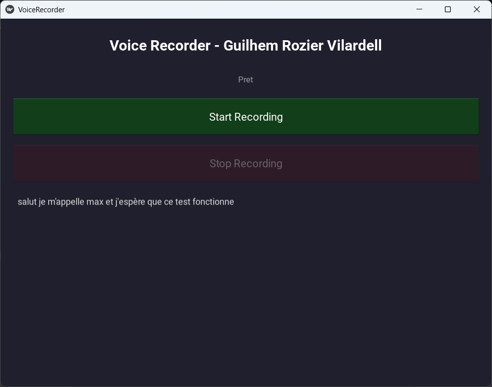
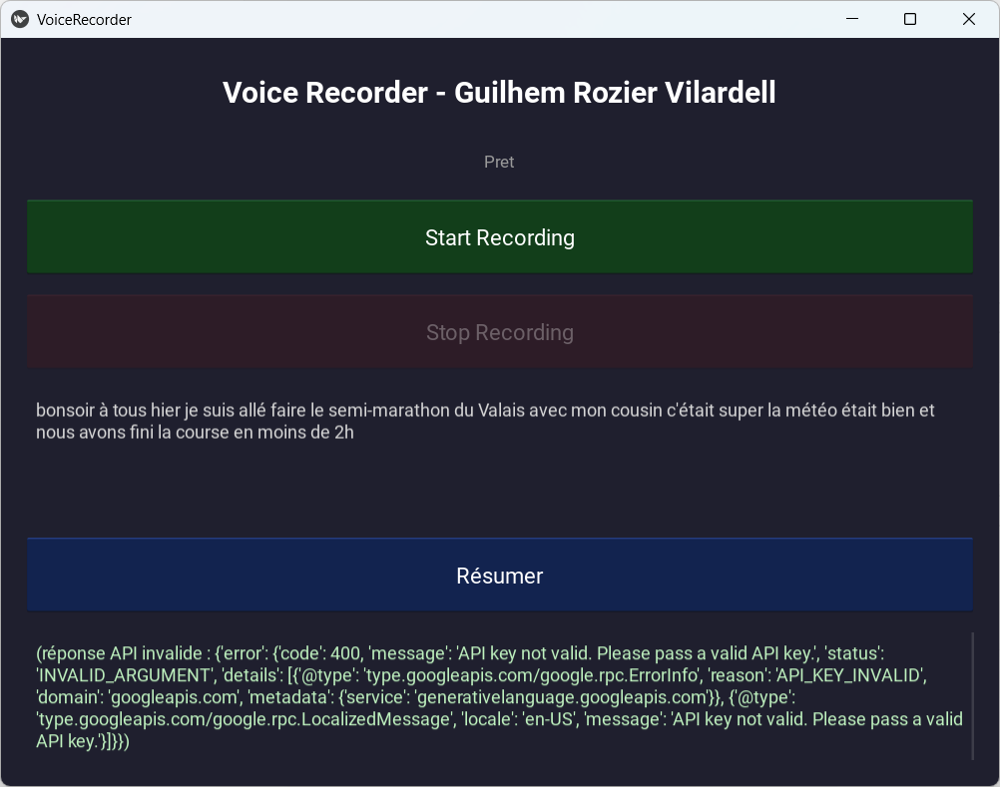
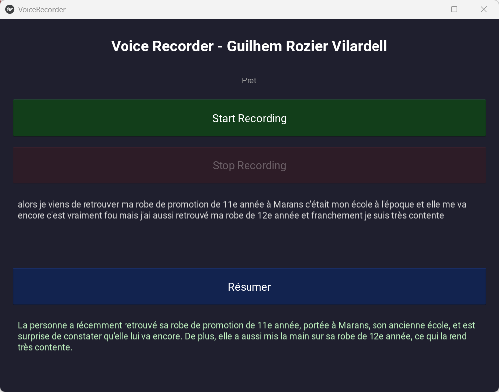
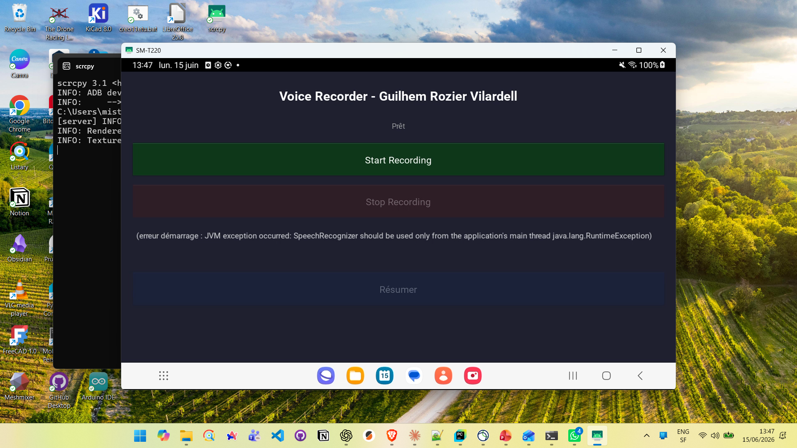
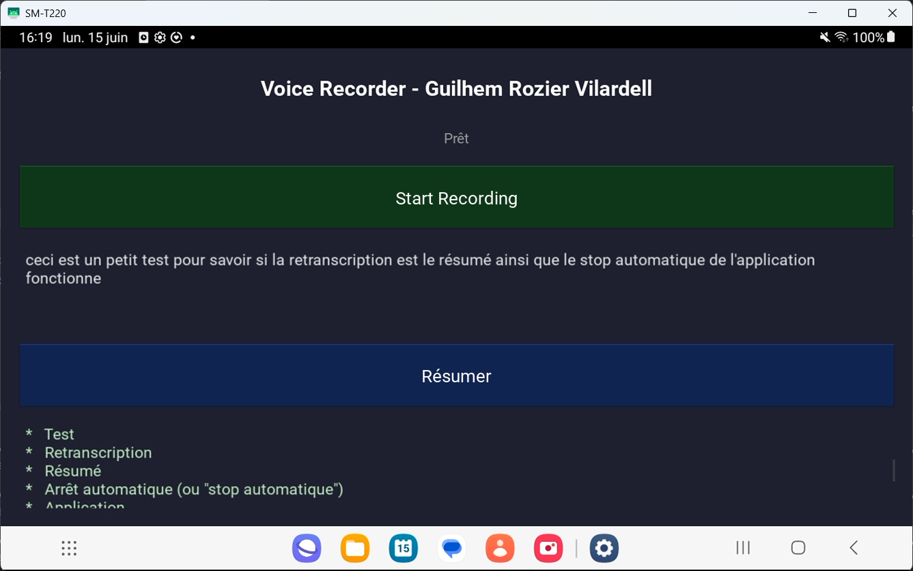

# Journal de Bord — Voice recorder

**Auteur :** Guilhem Rozier Vilardell  
**Période :** 28/04/2026 – 16/06/2026

---

## 29/04/2026

### Ce que j'ai fait
- création du cahier des charges et discussion avec Claude (IA) sur les différentes possibilités de construire le projet.
- Identification de solutions pour chaque partie 
  - SpeechRecognition Library pour la *transcription*
  - API Google Gemini pour le *résumé*
  - Kivy pour *l'implémentation et l'affichage* sur android

### Difficultés
- Choisir la solution la plus simple, mais qui a le moins de dépendances possibles:
  - connexion internet obligatoire (pour résumé)
  - uniquement des outils gratuits
  - bon fonctionnement sur windows et android

---

## 06/05/2026

### Ce que j'ai fait
- Implementation de la structure de base dans le projet, comme mentionné sur le readme. (utilisation de Claude IA afin d'être conseillé sur la bonne structure à avoir pour rester professionnel et modulable)
- création du venv

### Difficultés
- trouver les version compatibles de toutes les librairies

---

## 10/05/2026
 
### Ce que j'ai fait
- création de la première version du code fonctionnel grâce à l'aide de Claude IA
  - main et inteface kv
### Difficultés
- comprendre le code

---

## 21/05/2026
 
### Ce que j'ai fait
- Recommencer du début en gardant simplement la structure initiale. Le but est de construire un code beaucoup plus simple, compréhensible et surtout de mon niveau.
- Remise à 0 de tous les fichiers
- Ecriture du main et du .kv : enregistrement et retranscription fonctionelle

### Difficultés
- gestion de quel bouton peut et ne peut pas être activé à quel moment
- conversion bytes -> bande son et plus généralement la librairie sr (speech_recognition)

---

## 25/05/2026
 
### Ce que j'ai fait
- ajout du bouton résumé et de l'affichage du texte
- ajout de la fonction résumé (pas encore fonctionnelle)
### Difficultés
- connexion à l'API, je n'arrive pas à lire dans le fichier config avec dotenv (résultat de print(GEMINI_API_KEY) dans main = NONE)

---

## 01/06/2003
 
### Ce que j'ai fait
- modification du bloc de lécture de la clé API -> accès à l'API fonctionnel
- étape de résumé fonctionnel
### Difficultés
- anciens code d'accès était fonctionnel, mais pas celui de cette version
- comprendre la différence entre les 2
- L'ancien code d'accès à l'API fonctionnait, mais pas celui de cette version (même clé).
- Cause trouvée en inspectant les octets de `config.env` : un **BOM** invisible (`EF BB BF`, ajouté par l'éditeur) collé en tête de fichier corrompait le nom de la variable → `os.getenv("GEMINI_API_KEY")` renvoyait `None`.
- L'ancienne version marchait par accident : son `config.env` avait un commentaire en ligne 1, qui absorbait le BOM. Sans ce commentaire, le BOM tombait sur la ligne de la clé.
- Correction : lecture avec `encoding="utf-8-sig"` (supprime le BOM de façon fiable, sans dépendre d'un commentaire).
- Second bug masqué : le modèle `gemini-2.0-flash` était déprécié (→ erreur quota `limit: 0`). Passage à `gemini-2.5-flash`.

---

## 08/06/2026
 
### Ce que j'ai fait
- Transfer de l'application Voice Recorder de Windows vers Android
- Remplacement de `sounddevice` (incompatible Android) par `AudioRecord` via pyjnius, puis abandon au profit de `android.speech.SpeechRecognizer` (API Android native, plus simple et sans dépendance externe)
### Difficultés
- `SpeechRecognizer` impose d'être instancié et utilisé uniquement sur le UI thread Android — le thread Kivy et `Clock.schedule_once` ne suffisent pas, il faut passer par `activity.runOnUiThread()`

---

## 15/06/2026
 
### Ce que j'ai fait
- Nettoyage du code : suppression du bouton Stop, des librairies inutiles, des fichiers superflus
- Présentation et documentation du code

---

## JJ/MM/AAAA
 
### Ce que j'ai fait
- 
### Difficultés
- 

---

## JJ/MM/AAAA
 
### Ce que j'ai fait
- 
### Difficultés
- 

---

## JJ/MM/AAAA
 
### Ce que j'ai fait
- 
### Difficultés
- 

---

## JJ/MM/AAAA
 
### Ce que j'ai fait
- 
### Difficultés
- 

---

## JJ/MM/AAAA
 
### Ce que j'ai fait
- 
### Difficultés
- 

---